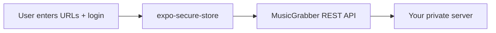

# Public Repository Security Audit

Last audit: 2026-06-14

## Summary

| Category | Status | Notes |
|----------|--------|-------|
| API keys / passwords in source | **OK** | None hardcoded; auth via SecureStore at runtime |
| Bearer tokens in repo | **OK** | Only code references, no values |
| `.env` files | **OK** | `.env` in `.gitignore`; only `.env.example` tracked |
| Personal URLs in current source | **Fixed** | Replaced with placeholders in README, setup defaults, scripts |
| Git history (remote) | **WARNING** | Older commits on GitHub branches still contain `192.168.1.6` and `hmfrk.fun` |
| Build artifacts | **OK** | `dist/`, `node_modules/`, keystores in `.gitignore` |
| Expo/EAS secrets | **OK** | No credentials in `eas.json` |

## What the app stores (device only, never in git)

- MusicGrabber LAN + remote URLs → `expo-secure-store`
- Session bearer token → `expo-secure-store`
- Username (not password) → `expo-secure-store`

## Files safe to publish (current tree)

- All `src/` application code (generic API client)
- `app/` screens (empty URL defaults in setup)
- `scripts/verify-server.sh` (localhost defaults, override via env)
- `.env.example` (no secrets)

## Before making the repo public

1. **Prefer a fresh public repo** with a single squashed commit from sanitized `feat/mobile-ui` — avoids leaking URLs from git history.
2. **Or** rewrite history on the existing repo (`git filter-repo`) and force-push — only if you accept rewriting remote branches.
3. Delete open PRs #1–#3 on the private repo or close them; they contain personal URLs in committed files.
4. Do not commit `.env`, APK signing keys (`.jks`, `.keystore`), or EAS credentials.
5. Optional: change Android package from `fun.hmfrk.musicgrabber` to something generic before public release.

## Git history exposure (found via `git grep`)

Personal data appeared in commits on branches:

- `chore/expo-sdk54-setup`
- `feat/api-auth-foundation`
- `feat/mobile-ui`

Fields: `192.168.1.6`, `musicgrabber.hmfrk.fun` in README, `setup.tsx`, `verify-server.sh`.

**Current working tree is sanitized; history is not.**

## Recommended public repo workflow

```bash
# New clean public repo (recommended)
git checkout feat/mobile-ui
# ensure sanitized files committed
git checkout -b public-release
git remote add public git@github.com:YOU/musicgrabber-mobile.git
git push public public-release:main
```

## Runtime data flow (nothing leaves the device to git)


